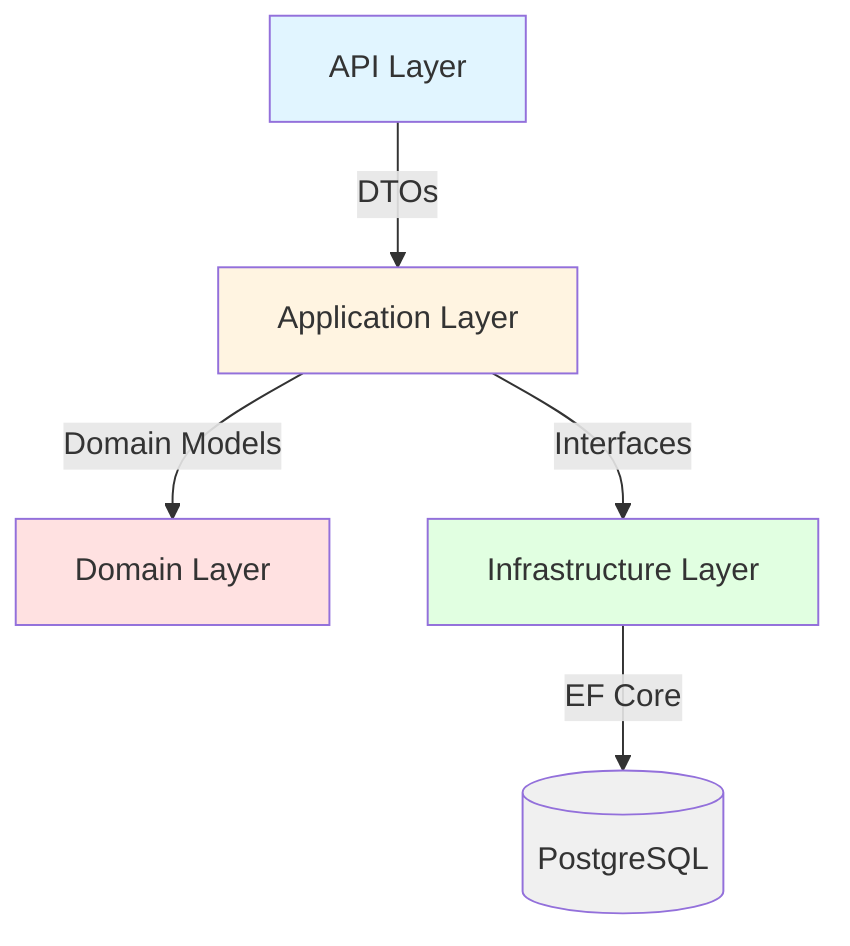

# Task Management System

A full-stack task management web application built with .NET 8 and React.

> **Portfolio Project** - Built to showcase software development skills and architectural design patterns.
> 
## Table of Contents
- [Tech Stack](#-tech-stack)
- [Architecture](#-architecture)
- [Features](#-features)
- [Getting Started](#-getting-started)
- [API Endpoints](#-api-endpoints)

## Tech Stack

### Backend
- **.NET 8** - Web API with Clean Architecture
- **PostgreSQL** - Relational database
- **Entity Framework Core** - ORM with migrations
- **BCrypt** - Password hashing
- **xUnit + Moq** - Unit testing

### Infrastructure
- **Docker & Docker Compose** - Containerization
- **GitHub Actions** - CI/CD pipeline
- **Swagger** - API documentation

### Frontend *(Planned)*
- **React** - UI framework
- **TypeScript** - Type safety

## Architecture


**Clean Architecture Layers:**
- **Domain** - Core business entities and enums
- **Application** - Business logic, DTOs, services, validation
- **Infrastructure** - Data access, repositories, EF Core
- **API** - Controllers, middleware, dependency injection

## Features

### Completed
- [x] User Management (CRUD)
  - [x] Polymorphic user roles (Admin, Client, Employee, Project Manager)
  - [x] Password validation and hashing
  - [x] Unique username/email constraints
- [x] Task Management (CRUD)
  - [x] Task assignment to users
  - [x] Status tracking (NotStarted, InProgress, Completed, OnHold, Cancelled)
  - [x] Date-based scheduling
- [x] Exception Handling
  - [x] Global exception middleware
  - [x] Custom exception types
- [x] Testing
  - [x] Comprehensive unit tests
  - [x] AAA pattern with Moq
- [x] DevOps
  - [x] Docker containerization
  - [x] GitHub Actions CI/CD
  - [x] Branch protection rules

### In Progress
- [ ] JWT Authentication & Authorization
- [ ] React Frontend
- [ ] Role-based access control

### Planned
- [ ] Real-time updates (SignalR)
- [ ] File attachments
- [ ] Search and filtering
- [ ] Email notifications
- [ ] API rate limiting

## Technical Highlights

- **Clean Architecture** - Organized code into layers (API, Business Logic, Data Access, Domain) so each part has a single responsibility
- **Polymorphic Users** - Different user types (Admin, Employee, Client, Manager) inherit from a base User class, stored efficiently in one database table
- **Password Security** - User passwords are hashed with BCrypt before storage (never stored as plain text)
- **Repository Pattern** - Database operations go through repository classes, making it easy to swap databases if needed
- **Dependency Injection** - Components receive their dependencies instead of creating them, improving testability
- **Global Exception Handling** - Middleware catches all errors and returns consistent JSON responses to the client
- **Database Constraints** - Username/email uniqueness enforced at the database level for data integrity
- **Unit Testing** - Service layer tested with mocked dependencies using the AAA pattern (Arrange, Act, Assert)

## Getting Started

### Prerequisites
- .NET 8 SDK
- Docker Desktop
- PostgreSQL (via Docker)

### Run Locally

1. **Start PostgreSQL**
```bash
   docker-compose up -d
```

2. **Run the API**
```bash
   cd backend/TaskManager.Api
   dotnet run
```

3. **Access Swagger**
```
   https://localhost:7250/swagger
```

### Run Tests
```bash
cd backend/TaskManager.Tests
dotnet test
```

## API Endpoints

### Users
- `POST /api/user` - Create user
- `GET /api/user` - Get all users
- `GET /api/user/{id}` - Get user by ID
- `PUT /api/user/{id}` - Update user
- `DELETE /api/user/{id}` - Delete user

### Tasks
- `POST /api/task` - Create task
- `GET /api/task` - Get all tasks
- `GET /api/task/{id}` - Get task by ID
- `PUT /api/task/{id}` - Update task
- `DELETE /api/task/{id}` - Delete task
- `POST /api/task/{taskId}/assign/{userId}` - Assign task
- `POST /api/task/{taskId}/status/{status}` - Update status

## Development Approach
I work in small commits, building features piece by piece. Business logic gets written first, then the API endpoints that expose it. Tests cover the main functionality, and I let the code speak for itself rather than over-commenting. Database constraints handle uniqueness checks since that's where they belong.
